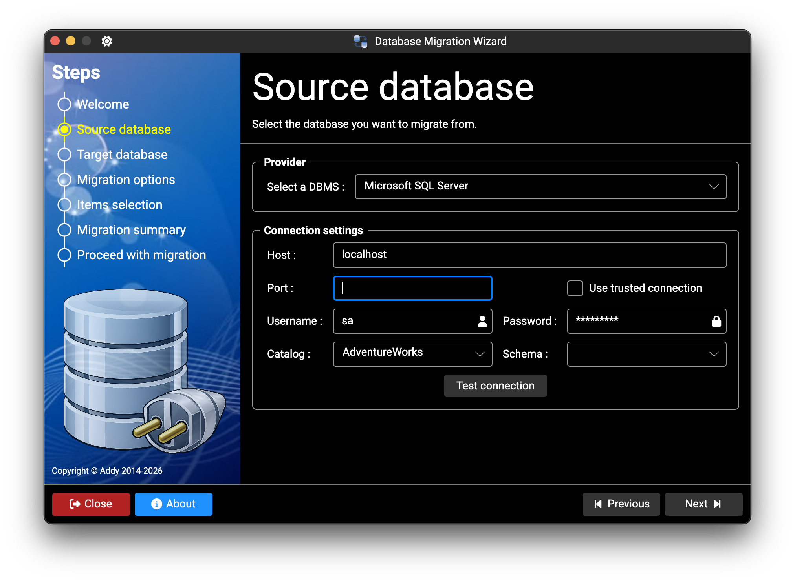
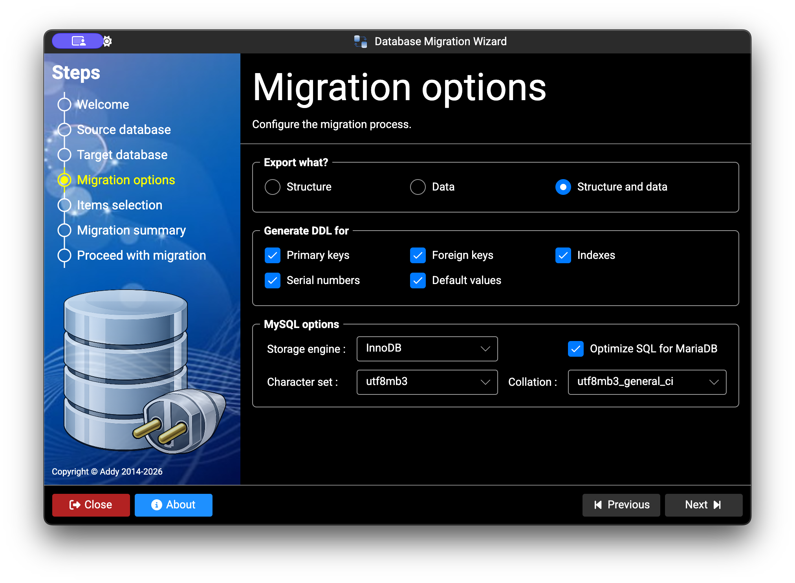
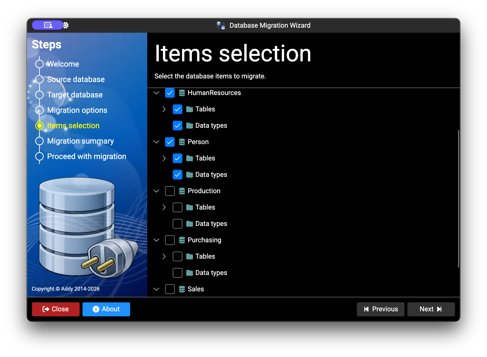
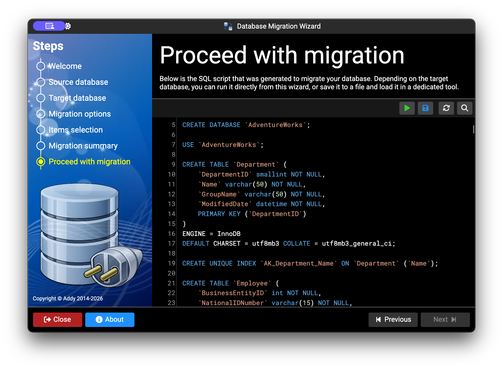

# DbExport

DbExport is a desktop database migration wizard built with .NET and Avalonia.
It helps you migrate schema and/or data between different database engines.

## Features

- Guided 7-step migration workflow
- Schema and data migration support
- Selective export options (primary keys, foreign keys, indexes, defaults, identity columns)
- Object-level selection before script generation
- SQL script generation and execution from the app
- Save generated scripts as `.sql`

## Library Module (Mini-ORM)

`DbExport.Api` can also be used as a lightweight mini-ORM/data-access helper.

- Provider-agnostic ADO.NET helper (`SqlHelper`) for query, scalar, execute, and script execution
- Automatic SQL parameter discovery from SQL text (`@name`, `:name`, etc.)
- Multiple binders for command parameters (`FromArray`, `FromDictionary`, `FromEntity`)
- Data reader extractors for single-row and multi-row mapping (array, dictionary, entity)
- `TableExtensions` helpers to generate provider-specific SQL (`GenerateSelect`, `GenerateInsert`, `GenerateUpdate`, `GenerateDelete`)
- Lightweight CRUD helpers on schema tables (`Select`, `Insert`, `Update`, `Delete`) with batch variants (`InsertBatch`, `UpdateBatch`, `DeleteBatch`)
- Cross-database copy helper (`CopyTo`) to move table data between providers

### Examples

`SqlHelper` - query + scalar:

```csharp
using var helper = new SqlHelper(providerName, connectionString);
var users = helper.Query("SELECT Id, Name FROM Users", SqlHelper.ToDictionaryList);
var totalUsers = helper.QueryScalar("SELECT COUNT(*) FROM Users");
```

`SqlHelper` - parameterized query:

```csharp
var user = helper.Query(
    "SELECT Id, Name, Email FROM Users WHERE Id = @Id",
    new { Id = 42 },
    (cmd, p) => cmd.Parameters["Id"].Value = p.Id,
    SqlHelper.ToDictionary);
```

`SqlHelper` - execute + batch insert with entity binding:

```csharp
public sealed class UserRow
{
    public int Id { get; set; }
    public string Name { get; set; } = "";
    public string Email { get; set; } = "";
}

var inserted = helper.Execute(
    "INSERT INTO Users (Id, Name, Email) VALUES (@Id, @Name, @Email)",
    new UserRow { Id = 1, Name = "Ada", Email = "ada@example.com" },
    SqlHelper.FromEntity);

var batchInserted = helper.ExecuteBatch(
    "INSERT INTO Users (Id, Name, Email) VALUES (@Id, @Name, @Email)",
    new[]
    {
        new UserRow { Id = 2, Name = "Linus", Email = "linus@example.com" },
        new UserRow { Id = 3, Name = "Grace", Email = "grace@example.com" }
    },
    SqlHelper.FromEntity);
```

`TableExtensions` - schema-driven CRUD:

```csharp
using DbExport.Providers;
using DbExport.Schema;

var db = SchemaProvider.GetDatabase(providerName, connectionString, "dbo");
var usersTable = db.Tables["dbo.Users"]; // FullName: "<schema>.<table>"

var allUsers = usersTable.Select<UserRow>();
var added = usersTable.Insert(new UserRow { Id = 10, Name = "Marie", Email = "marie@example.com" });
var updated = usersTable.Update(new UserRow { Id = 10, Name = "Marie Curie", Email = "marie@example.com" });
var deleted = usersTable.Delete(10); // single-column PK
```

`TableExtensions` - copy rows to another provider:

```csharp
var sourceDb = SchemaProvider.GetDatabase(sourceProvider, sourceConnectionString, "public");
var sourceUsersTable = sourceDb.Tables["public.users"];

using var targetConnection = Utility.GetConnection(targetProvider, targetConnectionString);
targetConnection.Open();

sourceUsersTable.CopyTo(
    targetConnection,
    QueryOptions.QualifyTableName,
    QueryOptions.All);
```

## Supported Databases

- Microsoft SQL Server
- Oracle Database
- MySQL
- PostgreSQL
- Firebird
- SQLite
- Microsoft Access (Windows only)
- SQL Server LocalDB (Windows only)

## Platform Notes

- Windows target: `net10.0-windows`
- Linux/macOS target: `net10.0`
- Access support is Windows-only (OLE DB/COM interop)

## Requirements

- .NET 10 SDK
- Access to source and target databases
- Sufficient DB permissions for schema/data migration

## Getting Started

```bash
dotnet restore
dotnet build
dotnet run --project DbExport.Gui
```

## Running Tests

```bash
dotnet test
```

## Publishing
Depending on the target platform, you can publish the app as a single executable
or a self-contained .NET 10 app using one of the following commands:

```bash
dotnet publish DbExport.Gui/DbExport.Gui.csproj -c Release -r win-x64
dotnet publish DbExport.Gui/DbExport.Gui.csproj -c Release -r win-arm64
dotnet publish DbExport.Gui/DbExport.Gui.csproj -c Release -r linux-x64
dotnet publish DbExport.Gui/DbExport.Gui.csproj -c Release -r linux-arm64
dotnet publish DbExport.Gui/DbExport.Gui.csproj -c Release -r osx-arm64
```

**Notes:**
- Artifacts are emitted under `Bin/Release/`.
- You can ommit the `DbExport.Gui/DbExport.Gui.csproj` part if you run the command from the GUI project directory.
- Each of the above commands is suitable foe a specific OS and architecture, and will create a self-contained app with the specified runtime.
- You can use the `--self-contained=false` option to create a portable app that can be run on any OS and architecture. But this will require the user to install .NET 10 runtime on their machine.

## Screenshots

### 1. Source Database Setup
Use this screen to configure the source database connection:
server/host, port, username, and password.
You can also choose the source schema to migrate.
A similar screen is used to configure the target database.



### 2. Migration Options
Use this screen to choose the migration mode and options, including whether to include primary keys, foreign keys, defaults, indexes, and identity columns.
You can export schema only, data only, or both.
For some providers, additional provider-specific options are available.



### 3. Items Selection
On this screen, you can choose which tables, columns, keys, and indexes to include in the migration.



### 4. Generated SQL Script
The final screen displays the generated SQL script.
Depending on the selected target provider, you can save the script to a file or execute it directly.
To run it directly, the target connection must be correctly configured in the third step.
For Oracle targets, create the destination schema manually before starting the migration.



## Solution Structure

- `DbExport.Gui`: Avalonia desktop app
- `DbExport.Api`: Core migration logic and providers
- `DbExport.Tests`: Unit tests

## Logging

Logs are written to the OS local app data folder:

- `DbExport/app.log`

## License

Apache 2.0. See [LICENSE](LICENSE).
